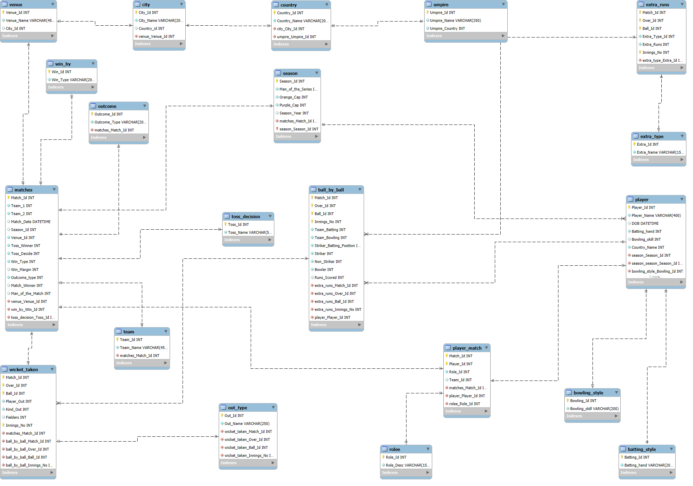

# 🏏 IPL Team Analysis – RCB Strategy for Mega Auction SQL Project

A SQL-driven data analysis project using IPL match and ball-by-ball datasets (2008–2016), aimed at helping **Royal Challengers Bangalore (RCB)** define a strategy for the **2017 Mega Auction**.

---

## 🎥 Video Walkthrough

🎬 [Walkthrough Video](http://www.linkedin.com/in/naveenvarjani)  
*A short walkthrough explaining data sources, SQL logic, insights, and key recommendations.*

---

## 📘 Project Overview

🎯 **Goal**: Identify player performance trends and recommend optimal retentions/acquisitions based on historical data.

🖼️ **Entity Relationship Diagram**  

---

## 🧰 Tools & Techniques Used

**🛠️ MySQL** – for data loading, cleaning, querying

### 🔍 Data Analysis with SQL
- Joins, aggregations, subqueries, `CASE` statements
- Grouped stats across player, match, venue, season
- Analytical comparisons across years
- Query-based insights for player retention strategy

### 📊 Reporting & Storytelling
- 15+ business questions answered via structured SQL queries
- Strategic storytelling aligned with RCB's auction strategy
- Visual storytelling using charts in PowerPoint

---

## 🧭 Storyline Walkthrough

### 🎯 Objective
Use IPL data to analyze player performance, uncover patterns, and suggest a strategy for RCB’s 2017 Mega Auction.

### 🔍 Key Insights
- 🏏 **Virat Kohli** was RCB’s top performer with the most runs and consistent impact  
- ⚡ **Chris Gayle** had high impact but was inconsistent in recent seasons  
- 💰 **Yuzvendra Chahal** was a high-value bowler with wicket-taking consistency  
- 📉 Bowlers like **Varun Aaron** had expensive economy and lower impact  
- 🏟️ **Chinnaswamy Stadium** yielded high runs — batsman-friendly venue  
- 📊 RCB’s match-winning performance was stronger when **batting second**

---

## 📈 Visual Highlights

Charts and visuals included in the final report:

- 🏏 Top 10 Run Scorers for RCB  
- 🎯 RCB Players: Avg. Runs vs. Matches Played  
- 🧤 Top Bowlers by Total Wickets  
- 📉 Player Economy vs. Strike Rate  
- 🗓️ Season-wise RCB Performance Trend  
- 🏆 Matches Won vs. Toss Decision  
- 👥 Recommended Players to Retain  
- 💸 Underperformers to Release or Trade  

---

## 📌 Strategic Suggestions

- ✅ **Retain**: Virat Kohli, AB de Villiers, Yuzvendra Chahal  
- 🚫 **Release/Trade**: Varun Aaron, Kedar Jadhav  
- 🔄 Acquire consistent middle-order stabilizers & death-over specialists  
- 🧠 Use toss/match insights to optimize play order strategy  
- 📊 Focus on data-driven decision-making during auction planning

---

## 💡 Outcome

This SQL-driven analysis helped simulate a **real-world sports strategy scenario**, transforming raw cricket data into actionable decisions.

> 🧠 Demonstrated practical SQL skills, domain understanding, and storytelling — all through the lens of IPL analytics.

---

## 👨‍💻 About Me

I'm a data enthusiast driven by curiosity and a passion for solving real-world problems using data.  
Each project represents a step in turning insights into impact.

### 🔗 Let’s Connect:
- [💼 LinkedIn](http://www.linkedin.com/in/naveenvarjani)  
- [📄 Resume](https://github.com/naveenvarjani/naveen-resume/raw/main/Resume.pdf)  
- [📊 Portfolio](https://www.notion.so/Naveen-Varjani-Data-Science-Portfolio-41788bba67db45bc90fa2b2e2b9e25b4)  
- [✉️ Email Me](mailto:varjaninaveen@gmail.com)
